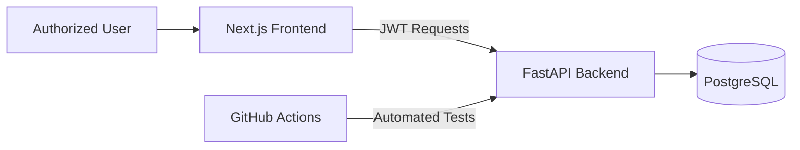

# ThreatLens# ThreatLens

ThreatLens is a full-stack Cyber Threat Intelligence dashboard for managing Indicators of Compromise (IOCs), monitoring high-risk threats, reviewing security alerts, and visualizing threat activity.

## Live Application

- Frontend: https://threat-lens-dusky.vercel.app
- Backend API: https://threatlens-3sro.onrender.com
- API Documentation: https://threatlens-3sro.onrender.com/docs

> The dashboard requires an authorized account. Public registration is disabled.

## Features

- Cyber threat overview dashboard
- IOC creation, search, filtering, and deletion
- Critical and high-severity alert monitoring
- Global threat map visualization
- Intelligence feeds monitoring
- Security reports and settings pages
- PostgreSQL persistent database
- JWT-based authentication
- Protected frontend routes
- Protected indicator creation and deletion APIs
- Public registration lock
- Responsive dark SOC interface
- Automated API tests
- GitHub Actions CI workflow

## Technology Stack

### Frontend

- Next.js 16
- React
- TypeScript
- Tailwind CSS
- Lucide React
- Recharts
- Vercel

### Backend

- Python
- FastAPI
- SQLAlchemy
- PostgreSQL
- PyJWT
- Argon2 password hashing
- Uvicorn
- Render

### Testing and CI

- Pytest
- FastAPI TestClient
- HTTPX
- GitHub Actions

## Architecture



## Project Structure

```text
ThreatLens/
├── backend/
│   ├── app/
│   │   ├── api/
│   │   │   ├── auth.py
│   │   │   └── indicators.py
│   │   ├── core/
│   │   │   ├── database.py
│   │   │   └── security.py
│   │   ├── models/
│   │   │   ├── indicator.py
│   │   │   └── user.py
│   │   ├── schemas/
│   │   │   ├── indicator.py
│   │   │   └── user.py
│   │   └── main.py
│   ├── tests/
│   │   └── test_api.py
│   ├── requirements.txt
│   └── requirements-dev.txt
├── frontend/
│   ├── app/
│   │   ├── alerts/
│   │   ├── components/
│   │   ├── indicators/
│   │   ├── intelligence-feeds/
│   │   ├── login/
│   │   ├── reports/
│   │   ├── settings/
│   │   ├── threat-map/
│   │   └── page.tsx
│   └── package.json
├── .github/workflows/
│   └── backend-tests.yml
├── pytest.ini
└── README.md
```

## API Endpoints

| Method | Endpoint | Description | Authentication |
|---|---|---|---|
| GET | `/` | API status | No |
| GET | `/health` | Health check | No |
| GET | `/api/dashboard/stats` | Dashboard statistics | No |
| GET | `/api/indicators` | List indicators | No |
| POST | `/api/indicators` | Create indicator | JWT required |
| DELETE | `/api/indicators/{id}` | Delete indicator | JWT required |
| POST | `/api/auth/login` | Generate access token | No |
| GET | `/api/auth/me` | Current user information | JWT required |
| POST | `/api/auth/register` | Public registration | Disabled |

## Local Installation

### 1. Clone the repository

```bash
git clone https://github.com/dev2606-code/ThreatLens.git
cd ThreatLens
```

### 2. Backend setup

```bash
python3 -m venv venv
source venv/bin/activate
pip install -r backend/requirements.txt
```

Create the required environment variables:

```env
DATABASE_URL=sqlite:///./threatlens.db
SECRET_KEY=replace_with_a_secure_random_secret
ALLOW_REGISTRATION=false
```

Start the backend:

```bash
uvicorn backend.app.main:app --reload
```

Backend will run at:

```text
http://127.0.0.1:8000
```

### 3. Frontend setup

```bash
cd frontend
npm install
```

Create `frontend/.env.local`:

```env
NEXT_PUBLIC_API_URL=http://127.0.0.1:8000
```

Start the frontend:

```bash
npm run dev
```

Frontend will run at:

```text
http://localhost:3000
```

## Run Automated Tests

```bash
source venv/bin/activate
pip install -r backend/requirements-dev.txt
pytest -v
```

## Security

- Passwords are hashed using Argon2.
- Authentication uses expiring JWT access tokens.
- Indicator creation and deletion require authentication.
- Frontend dashboard routes are protected.
- Public user registration is disabled.
- Production secrets are stored in environment variables.
- CORS is restricted to approved frontend origins.

## Deployment

- Frontend is deployed on Vercel.
- FastAPI backend is deployed on Render.
- Production data is stored in PostgreSQL.
- GitHub Actions runs backend tests automatically.

## Author

**Devendra Sinha**

BCA Student and Cybersecurity Enthusiast

GitHub: https://github.com/dev2606-code